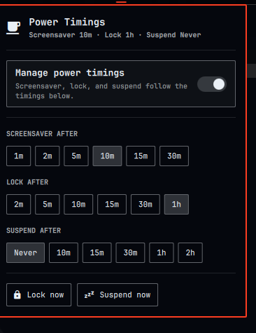

# Power Timings

An [Omarchy](https://omarchy.org/) shell plugin that adds a bar widget for
controlling how long the system waits before the screensaver, the lock
screen, and suspend kick in — plus quick "Lock now" / "Suspend now" actions.



## Why

Omarchy's built-in idle service already reads `idle.screensaver` and
`idle.lock` from `~/.config/omarchy/shell.json`, but there's no UI to change
them and no auto-suspend timeout at all. This plugin adds both: a popup with
preset buttons for all three timeouts, and a background timer that suspends
the machine after the configured idle period.

## Install

```
omarchy plugin add https://github.com/eddygarcas/omarchy-power-timings.git --enable
```

Or manually:

```
git clone https://github.com/eddygarcas/omarchy-power-timings.git \
  ~/.config/omarchy/plugins/eduard.power-timings
omarchy-shell shell rescanPlugins
omarchy plugin enable eduard.power-timings
```

## What it does

Click the bar icon to open the panel:

- **Manage power timings** — a switch at the top. Turn it off to disable
  everything below and let the system's own idle defaults apply (screensaver
  and lock keep working as Omarchy ships them; auto-suspend is disabled).
- **Screensaver after** / **Lock after** — preset buttons that write straight
  into `idle.screensaver` / `idle.lock` in `~/.config/omarchy/shell.json`,
  the same keys the built-in idle service already reads.
- **Suspend after** — a new `idle.suspend` timeout. A background service
  (`Service.qml`) watches for that much idle time and runs `systemctl
  suspend`. It respects the existing "Stay awake" indicator, so turning that
  on also pauses auto-suspend.
- **Lock now** / **Suspend now** — run `omarchy-system-lock` /
  `systemctl suspend` directly, regardless of the switch above.

Session locking before any suspend (manual or automatic) is already handled
by Omarchy's own `omarchy-sleep-lock` service, so this plugin never needs to
lock the screen itself before suspending.

## Known limitations

Changing `idle.screensaver` / `idle.lock` while the shell is already running
doesn't reliably re-arm a countdown that's already in flight — in testing, a
new short timeout sat for 90+ seconds with no effect until the shell was
restarted, at which point it fired right on schedule. This is a property of
Omarchy's built-in idle-notify plumbing that these preset buttons write into,
not something this plugin controls. If a preset click doesn't seem to take
effect immediately, run `omarchy restart shell` (or just wait through one
natural idle → active cycle) to make it stick.

## Remove

```
omarchy plugin remove eduard.power-timings
```

This deletes `~/.config/omarchy/plugins/eduard.power-timings/`, removes the
widget from your bar layout, and stops the background auto-suspend timer.
It does **not** revert `idle.screensaver` / `idle.lock` / `idle.suspend` in
`shell.json` — whatever values were last set stay in effect (the built-in
idle service keeps reading `idle.screensaver` / `idle.lock` either way).
Delete those keys by hand, or run `omarchy refresh shell`, if you want them
back to Omarchy's defaults too.

## Permissions & dependencies

- No external packages or network access required.
- Reads/writes `idle.*` in `~/.config/omarchy/shell.json` (same file the
  built-in idle service already owns).
- Reads `~/.local/state/omarchy/indicators/stay-awake` (the same file the
  built-in "Stay awake" bar indicator manages) to pause auto-suspend.
- Runs two commands, both already used by Omarchy's own system menu:
  `omarchy-system-lock` (Lock now) and `systemctl suspend` (Suspend now, and
  automatically once the configured suspend timeout elapses).
- Like every Quickshell plugin, this code runs unsandboxed inside the shared
  `omarchy-shell` process — review `Panel.qml` / `Service.qml` before
  installing.

## Files

| File           | Purpose                                                        |
|----------------|-----------------------------------------------------------------|
| `manifest.json`| Plugin manifest (`service` + `bar-widget`)                      |
| `Panel.qml`    | Bar icon + popup UI                                              |
| `Service.qml`  | Background auto-suspend timer                                   |
| `Model.js`     | Preset lists and duration formatting                             |

## License

MIT — see [LICENSE](LICENSE).
